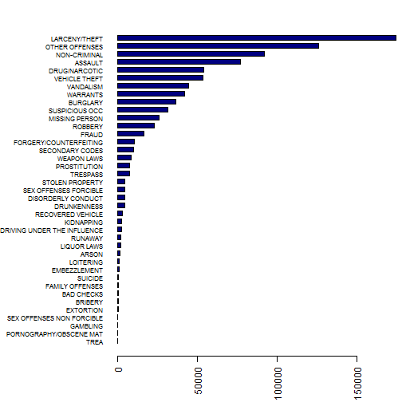
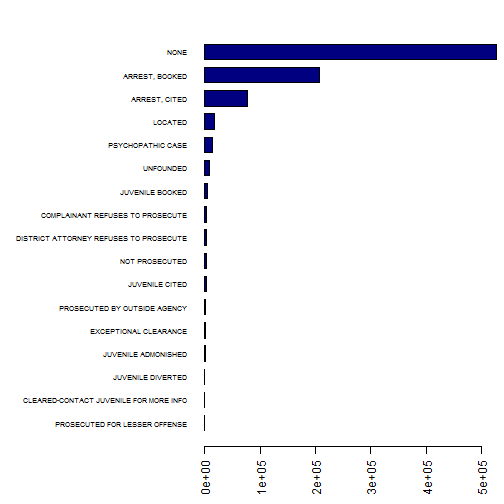
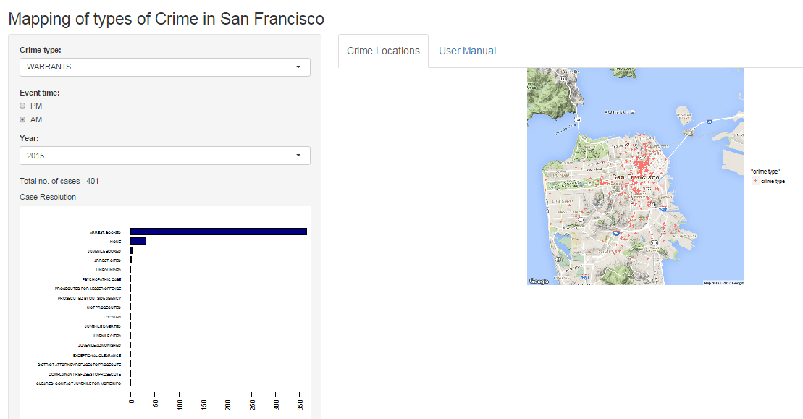

Crime Mapping of San Francisco
========================================================
author:Pradnya Chavan 
date: 02/24/2016
autosize: true

Introduction
========================================================

According to the FBI report, crime continued to fall around the country in 2015. However in the Bay area, the improvements are uneven. That is why we thought of giving closer look to this region and explore related data.

source (http://www.sfchronicle.com/crime/article/U-S-crime-drops-again-but-gains-uneven-in-Bay-6536129.php)

Data
========================================================

We got data from an open source platform. This data consist of following information

- Date and time at which crime took place
- Location of the crime
- Action taken on each case
- Police department district who handled exh of the cases

There were in total 878,050 cases ranging from year 2003 to 2015

Findings
========================================================
Following is the freqency of Different crimes

***

Following is the Frequency of categories of actions taken by PD

Final Output
========================================================
We built this App in order to visualize Sans Francisco Crime rate spreaded across different regions. It let user set different parameters as per user's interest.

Following is sample output

